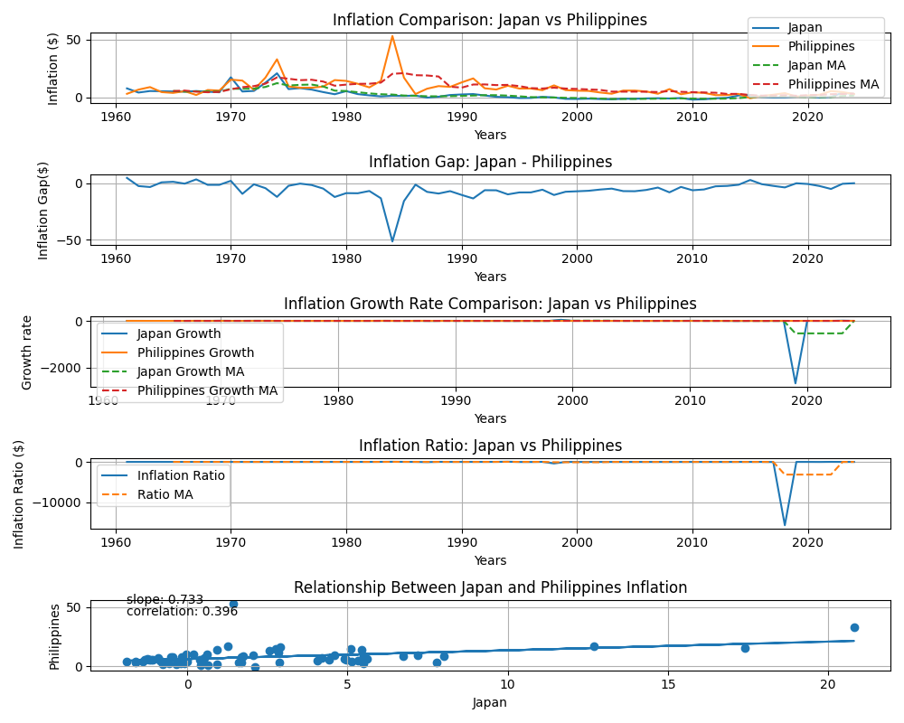

# Japan vs Philippines Inflation Analysis
This project compares inflation trends between Japan and the Philippines using historical economic data and Python.
The analysis examines differences in inflation levels, long-term trends, moving averages, year-to-year changes, and the relationship between inflation in the two countries.
The project was created to explore how two economies in the Asia-Pacific region experienced different inflation patterns over time.

## Research Question
* How have inflation rates changed in Japan and the Philippines over time?
* Which country experienced greater inflation volatility?
* How large was the inflation gap between the two countries?
* Did inflation in Japan and the Philippines tend to move together?
* What does the relationship between the two countries' inflation rates suggest?

## Data
**Source**: World Bank Open Data
**Countries**: Japan, Philippines
**Indicator**: Inflation, consumer prices (annual %)

## Tools Used
* Python
* pandas
* matplotlib
* NumPy

## Analysis
### 1. Inflation Trend Comparison
Compares annual inflation rates between Japan and the Philippines over time.
### 2. Moving Average Analysis
Uses moving averages to reduce short-term fluctuations and make longer-term trends easier to observe
### 3. Inflation Gap
Calculates the differences between Japan and the Philippines inflation:
**Japan Inflation - Philippines Inflation**
### 4. Growth Rate Analysis
Examines year-to-year changes in inflation
### 5. Inflation Ratio
Compares the relative level of inflation between the two countries
### 6. Correlation Analysis
Uses a scatter plot, correlation coefficient, and linear regression to examine the relationship between inflation in Japan and the Philippines

## Key Findings
* The Philippines generally experienced higher and more volatile inflation than Japan over much of the observed period.
* The inflation gap was particularly large during periods when Philippine inflation increased sharply.
* The correlation between Japanese and Philippine inflation was approximately **0.40**, suggesting a weak-to-moderate positive relationship.
* The positive regression slope suggests that higher inflation in Japan was generally associated with higher inflation in the Philippines in the dataset, although the relationship was not especially strong.
* Short-term movements in inflation did not always move in the same direction between the two countries.

## Visualization
### Inflation Trends

The visualization compares inflation levels, moving averages, the inflation gap, growth rates, ratios, and the relationship between Japan and the Philippines.

## Limitations
Some calculations, particularly growth rates and ratios, can become unstable when the original inflation value is close to zero.

Therefore, these measures should be interpreted carefully and should not be treated as standalone evidence of economic performance.

The analysis also focuses on correlation rather than causation. A correlation between the two countries does not necessarily mean that changes in one country's inflation caused changes in the other.

## Future Improvements
* Add ASEAN country comparisons
* Analyze core inflation
* Create prediction models
* Examine the relationship between inflation and GDP growth
* Add interest rates and exchange rates
* Create an interactive dashboard using Power BI

## What I learned
Through this project, I practiced:
* Working with real-world World Bank data
* Cleaning and organizing data using pandas
* Creating economic visualizations with Matplotlib
* Calculating moving averages
* Comparing economic indicators across countries
* Calculating correlations and regression relationships
* Interpreting economic data and identifying limitations in statistical analysis

## Future Project
This analysis will eventually be combined with my GDP, GDP per capita, and unemployment projects into a broader:
**Japan vs Philippines Economic Comparison Dashboard**
using Python, SQL, and Power BI
